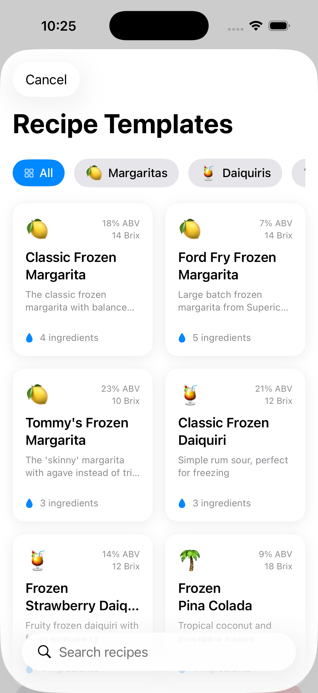
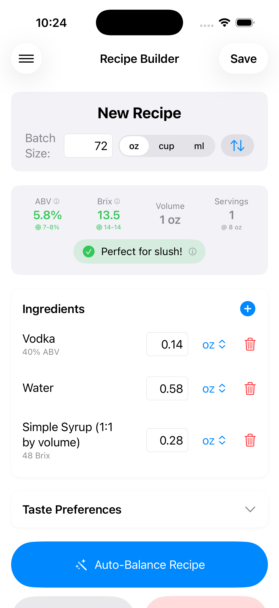
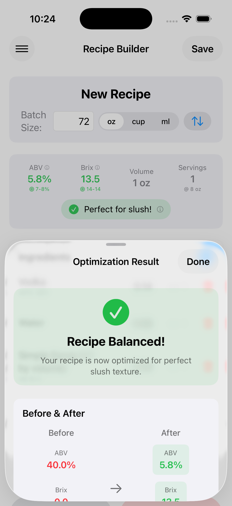
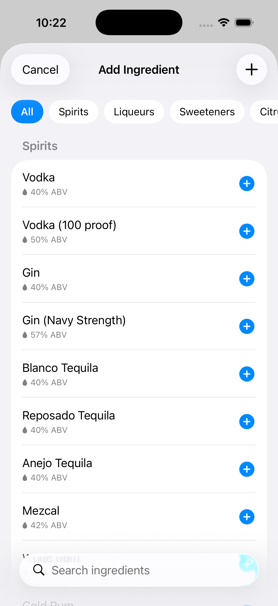

# Smart Slushi

A native iOS app for creating perfect frozen cocktails with your Ninja Slushi machine. Smart Slushi handles all the complex calculations for ABV, Brix (sugar content), and freezing point so you get perfect slush texture every time.

## Features

- **Recipe Builder** - Create custom frozen drink recipes with real-time ABV and Brix calculations
- **Auto-Balance** - Automatically optimize any recipe for perfect slush texture
- **Recipe Templates** - Start from pre-made recipes like Margaritas, Daiquiris, Pina Coladas, and more
- **Ingredient Database** - Comprehensive library of spirits, liqueurs, juices, sweeteners, and mixers
- **iCloud Sync** - Recipes automatically sync across all your devices
- **Taste Preferences** - Customize sweetness, thickness, and alcohol strength to your liking

## Screenshots

<p align="center">
  
  
  
  
</p>

## How It Works

Smart Slushi uses the science of freezing point depression to calculate optimal drink ratios:

1. **ABV (Alcohol By Volume)** - Too much alcohol and your drink won't freeze; too little and it freezes solid
2. **Brix (Sugar Content)** - Affects both sweetness and texture
3. **Target Range** - The app guides you to the "slushability zone" where drinks freeze to perfect consistency

## Requirements

- iOS 17.0+
- Xcode 16.0+
- Swift 6.1+

## Architecture

The app follows modern SwiftUI best practices:

- **SwiftUI + SwiftData** - Native Apple frameworks for UI and persistence
- **MV Pattern** - Simple Model-View architecture without ViewModels
- **Swift Concurrency** - Async/await with strict concurrency checking
- **SPM Package Structure** - All features in a Swift Package for modularity

```
SmartSlushi/
├── SmartSlushi.xcworkspace    # Workspace container
├── SmartSlushi/               # App shell (entry point only)
├── SmartSlushiPackage/        # All features and business logic
│   ├── Sources/
│   │   └── SmartSlushiFeature/
│   │       ├── Models/        # Data models
│   │       ├── Views/         # SwiftUI views
│   │       ├── Data/          # Persistence & stores
│   │       └── Services/      # Business logic
│   └── Tests/
└── Config/                    # Build configuration & entitlements
```

## Building

1. Open `SmartSlushi.xcworkspace` in Xcode
2. Select the `SmartSlushi` scheme
3. Build and run on simulator or device

## License

Private repository - All rights reserved.
